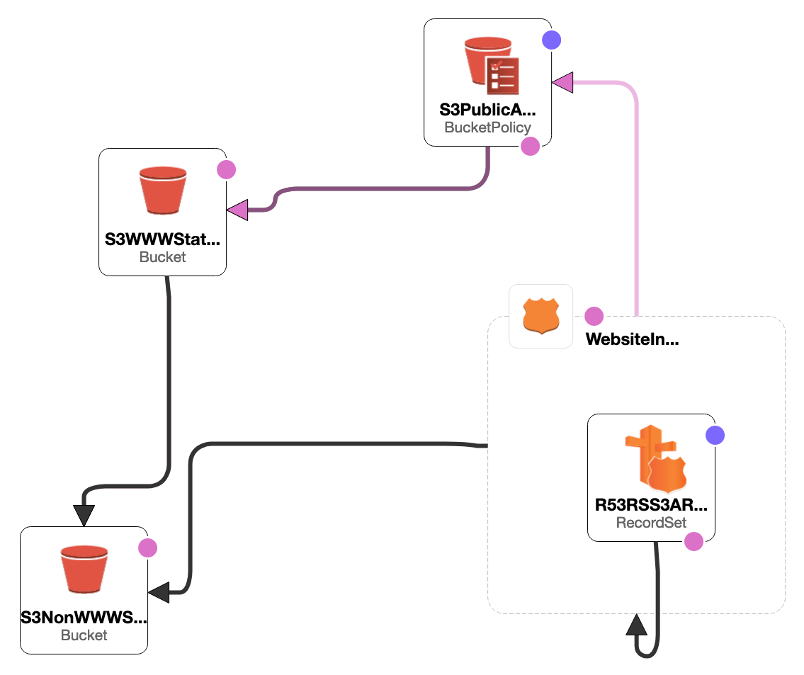

# How to use/Which field to change?

Enter your bucket name in the stack without `www`
  
Remember bucket name is unique Globally. Once the stack is complete upload your static html files in to `WWW` bucket and add `name-server` in your service provider.

