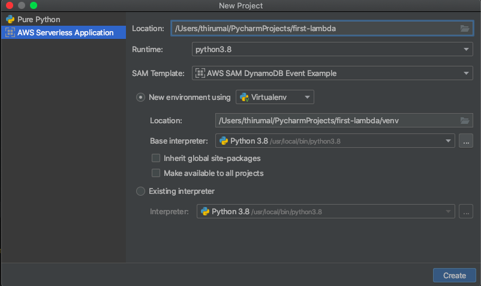

* File -> New Project and give the project name and configure other Venv

* Click on `CREATE` and `Create from Existing Source`
* Open it in `New Window`
* To build `sam build`
* It will create `.aws-sam` folder in the the project root directory
*  
   